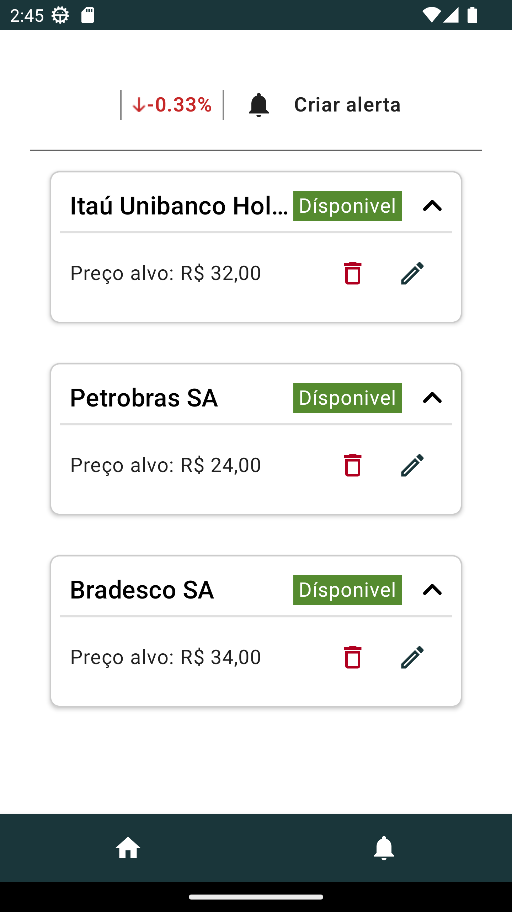

## Descrição

O projeto consiste em um aplicativo Android modular com os seguintes módulos: `app`, `home`, `stock`, `network`, `ui-components` e `analytics`. Cada módulo desempenha um papel específico na aplicação, facilitando a manutenção e a escalabilidade do código. Além disso, foram aplicados princípios como `SOLID` e `DRY` para promover uma arquitetura limpa e modular.

<div style="display:flex;">
    
    
    
    
    
    
    

</div>

## Rodar o Projeto

Esse projeto utiliza `multi-git`, por isso é necessário executar o clone dos repositorios abaixo.

1.Clone o repositório do projeto principal:

```bash
git clone https://github.com/flaviotps/ItauInvestiments.git
```

2. Navegue até o diretório `ItauInvestiments`, use o comando `cd ItauInvestiments` no terminal.

3. Clone os repositórios abaixo:

- itau-investment-ui-components
    ```bash
    git clone https://github.com/flaviotps/itau-investment-ui-components.git
    ```
- itau-investment-analytics
     ```bash
    git clone https://github.com/flaviotps/itau-investment-analytics.git
    ```
- itau-investment-network
     ```bash
    git clone https://github.com/flaviotps/itau-investment-network.git
    ```
- itau-investment-stocks
     ```bash
    git clone https://github.com/flaviotps/itau-investment-stocks.git
    ```
- itau-investment-home
     ```bash
    git clone https://github.com/flaviotps/itau-investment-home.git
    ```

4. Abra o projeto no Android Studio (Artic Fox - 2022.1 ou superior).

5. Execute o projeto `run`.

Você também pode gerar o APK (debug) com os seguintes passos:
 
 1. Executar diretamente pela IDE ou a task `./gradlew assemble` no terminal da IDE
 
 2. APK será gerado e estará localizado no diretório `app/build/outputs/apk/`

 3. Envie o APK para o seu aparelho ou arraste para o emulador.


## Estratégia de Implementação Modular

A estratégia de implementação modular traz consigo uma série de vantagens significativas que contribuem para a robustez e escalabilidade do aplicativo. Aqui estão algumas vantagens-chave:

### Baixo Acoplamento
Cada módulo é desenvolvido de forma independente, o que reduz o acoplamento entre eles. Isso significa que as alterações em um módulo têm menos probabilidade de afetar outros, facilitando a manutenção e a evolução do sistema.

### Alta Coesão
Os módulos são projetados para ter alta coesão, o que significa que cada módulo executa uma função específica e bem definida. Isso melhora a legibilidade do código e simplifica o entendimento das responsabilidades de cada parte do sistema.

### Reutilização de Código
Com a modularidade, é mais fácil identificar e reutilizar componentes comuns em diferentes partes do aplicativo. Isso reduz a duplicação de código e promove uma base de código mais limpa e eficiente.

### Facilidade de Teste
Os módulos independentes são mais fáceis de testar, pois podem ser isolados para testes unitários e de integração. Isso simplifica o processo de garantir a qualidade do software e facilita a identificação e correção de problemas.

### Manutenibilidade
A arquitetura modular facilita a manutenção do aplicativo a longo prazo, pois permite que desenvolvedores trabalhem em partes específicas do sistema sem afetar o resto do código. Isso simplifica a adição de novos recursos, correção de bugs e atualizações de segurança.

### Escalabilidade
Com a modularidade, o aplicativo está preparado para escalar de forma mais eficiente. Novos módulos podem ser adicionados conforme necessário, e a arquitetura flexível permite que o sistema cresça para lidar com novos requisitos e demandas dos usuários.

Em resumo, a estratégia de implementação modular proporciona uma base sólida para o desenvolvimento de aplicativos robustos, flexíveis e fáceis de manter. Ao adotar essa abordagem, as equipes de desenvolvimento podem criar sistemas mais resilientes e adaptáveis, preparados para enfrentar os desafios do ambiente digital em constante evolução.


## Estratégia de Implementação Arquitetural (MVVM)

Ao adotar a arquitetura MVVM no desenvolvimento Android, os benefícios incluem uma clara separação de responsabilidades entre Model, View e ViewModel.
Isso facilita a manutenção do código, permite reutilização de componentes e simplifica testes unitários. Além disso, o ViewModel sobrevive a recriações de Activities, garantindo a persistência de dados e evitando problemas de estado da UI.

`Model`: Representa os dados e a lógica de negócios.

`View`: Representa a interface do usuário (UI).

`ViewModel`: Age como um intermediário entre o Model e a View, gerenciando o estado da UI e expondo dados e comandos para a View.

### Aprimorando o MVVM com MVVM+CLEAN

O MVVM, pode ser insuficiente em projetos de grande porte. Para aprimorá-lo, é necessário integrar outras camadas, como as propostas pelo `CLEAN ARCHITETURE`.

#### Repository
O repositório age como uma camada intermediária entre as diversas fontes de dados (remotas e locais) e o restante da aplicação. Ele oferece uma interface única para acessar dados, promovendo a coesão e facilitando a manutenção do código, além de permitir a troca transparente entre diferentes fontes de dados.

#### Data Sources
Os data sources são responsáveis por gerenciar a obtenção e persistência de dados utilizando um `Service`. 
Essa camada é responsavel por fazer as configurações necessarias de um `Service`.

#### Service
É responsável por interagir com os recursos internos e externos. 

## Módulo App

O módulo `app` contém apenas classes de navegação e a classe MainActivity.

## Estratégia de Versionamento
Em um projeto Android multimodular, ter um repositório Git por módulo oferece uma série de benefícios significativos. Aqui estão algumas razões importantes:

- Isolamento de Alterações
  
- Controle de Acesso e Permissões
  
 - Gerenciamento de Dependências


  
<div style="display:flex;">


 </div>

## Módulo Home

O módulo "Home" se baseia nos módulos `network`, `analytics` e `ui-components` para criar telas específicas desta funcionalidade.
Todas as regras de negócio e funcionalidades exclusivas do módulo estão concentradas aqui.

## Módulo Stocks

O módulo "Stocks" utiliza os módulos `network`, `analytics` e `ui-components` para implementar telas específicas dessa funcionalidade. 
Todas as regras de negócio e funcionalidades exclusivas do módulo estão centralizadas aqui.

## Módulo Network

O módulo `Network` é responsável por gerenciar as operações de rede, incluindo métodos para realizar solicitações HTTPS.

Todas as solicitações feitas neste projeto devem aderir a um padrão de retorno consistente. Para isso, foi desenvolvida uma classe que controla os estados de uma solicitação.

A classe NetworkResult encapsula esses estados:

```kotlin
sealed interface NetworkResult<T : Any> {
    class Success<T : Any>(val data: T) : NetworkResult<T>
    class Error<T : Any>(val code: Int, val message: String?) : NetworkResult<T>
    class Exception<T : Any>(val exception: Throwable) : NetworkResult<T>
}
```

## Estados da Interface `NetworkResult<T : Any>`

### Success<T : Any>
- Este estado representa o sucesso da operação de rede.
- Quando uma solicitação é concluída com sucesso, este estado é retornado.
- Ele carrega os dados resultantes da operação de rede, representados pelo tipo genérico `T`.

### Error<T : Any>
- Este estado indica que ocorreu um erro durante a operação de rede.
- Ele inclui um código de erro (`code`) para identificar o tipo de erro que ocorreu.
- Além disso, pode conter uma mensagem de erro (`message`) opcional para fornecer informações adicionais sobre o erro.

### Exception<T : Any>
- Este estado representa uma exceção lançada durante a operação de rede.
- Se ocorrer uma exceção não tratada durante a execução da solicitação, este estado será retornado.
- Ele carrega a exceção (`exception`) lançada.


Para criar um serviço no estilo Retrofit, basta instanciar sua classe de serviço. Abaixo está um exemplo de como usar o NetworkClient:

```kotlin
val investmentRemoteService = NetworkClient(InvestmentService::class.java)
``` 

Dessa forma, uma instância da interface `InvestmentService` é automaticamente implementada pelo mecanismo do `Retrofit`. O `NetworkClient` mantém as configurações de rede centralizadas, como URL, interceptadores, adaptadores, etc.


## Módulo UI-Components

O módulo `ui-components` foi desenvolvido com o objetivo de fornecer uma variedade de componentes de interface do usuário reutilizáveis, como botões, caixas de diálogo, barras de progresso, entre outros. Um exemplo de componente reutilizável é mostrado abaixo:

```kotlin
/**
 * Composable function to display an expandable card.
 *
 * @param initialState Initial state of the card (expanded or collapsed).
 * @param titleContent Content of the title section.
 * @param content Content of the expandable section.
 */
@Composable
fun ExpandableCard(
    modifier: Modifier = Modifier,
    initialState: Boolean = false,
    titleContent: @Composable () -> Unit,
    content: @Composable () -> Unit
) {
    var expanded by remember { mutableStateOf(initialState) }
    val icon = if (expanded) Icons.Rounded.KeyboardArrowUp else Icons.Rounded.KeyboardArrowDown

    Card(
        elevation = 2.dp,
        shape = RoundedCornerShape(8.dp),
        border = BorderStroke(1.dp, Color.LightGray),
        modifier = Modifier
            .fillMaxWidth()
            .padding(16.dp)
            .clickable {
                expanded = !expanded
            }
    ) {
        Column(modifier = Modifier.padding(8.dp).fillMaxWidth()) {
            Row(
                modifier = Modifier.fillMaxWidth(),
                verticalAlignment = Alignment.CenterVertically,
                horizontalArrangement = Arrangement.SpaceBetween
            ) {
                Row(modifier = Modifier.padding(all = 8.dp)) {
                    titleContent()
                }
                Image(
                    modifier = Modifier.size(32.dp),
                    imageVector = icon,
                    colorFilter = ColorFilter.tint(color = Color.Black),
                    contentDescription = if (expanded) "Collapse" else "Expand"
                )
            }
            if (expanded) {
                Divider(thickness = 2.dp)
                content()
            }
        }
    }
}
```
### Outros componentes
- [card](/ui-components/src/main/java/br/com/itau/app/ui_components/card)
- [carousel](/ui-components/src/main/java/br/com/itau/app/ui_components/carousel)
- [commonns](/ui-components/src/main/java/br/com/itau/app/ui_components/commons)
- [graph](/ui-components/src/main/java/br/com/itau/app/ui_components/graph)
- [text](/ui-components/src/main/java/br/com/itau/app/ui_components/text)
- [theme](/ui-components/src/main/java/br/com/itau/app/ui_components/theme)

## Módulo Analytics

Estes exemplos demonstram como registrar eventos específicos, como cliques em elementos da interface ou transições entre telas, utilizando o módulo de analytics. Esses dados são cruciais para entender o envolvimento do usuário e aprimorar continuamente a experiência oferecida.

### Rastreando clicks
```kotlin
val params = mapOf("stock_name" to stock.name, 
                   "stock_price" to stock.price)

ItauAnalytics.logEvent(ItauAnalytics.CLICK,params)
```

### Rastreando navegação
```kotlin
const val SCREEN_HOME_TAB = "SCREEN_HOME_TAB"
ItauAnalytics.logEvent(ItauAnalytics.SCREEN_NAME, SCREEN_HOME_TAB)
```

### Painel do Google Analytics
No painel do Google Analytics, as informações enviadas, juntamente com um conjunto de dados importantes, são apresentadas de maneira organizada e acessível. Aqui, você pode explorar uma ampla gama de métricas e insights, permitindo uma compreensão mais profunda do desempenho e do comportamento do seu público-alvo.


## Testes e Princípios de Design

Testes automatizados garantem a qualidade do código, detectam bugs rapidamente, facilitam a refatoração e servem como documentação viva do comportamento do sistema, aumentando a confiança no software.

### Exemplo de Teste Instrumentado (UI)

```kotlin
class ExpandableCardTest {

    @get:Rule
    val composeTestRule = createComposeRule()

    @Test
    fun expandableCard_InitialState_Collapsed() {

        composeTestRule.setContent {
            ExpandableCard(
                initialState = false,
                titleContent = { Text(text = "Title") },
                content = { Text(text = "Content") }
            )
        }
        composeTestRule.onNodeWithText("Content").assertDoesNotExist()
    }

    @Test
    fun expandableCard_InitialState_Expanded() {
        composeTestRule.setContent {
            ExpandableCard(
                initialState = true,
                titleContent = { Text(text = "Title") },
                content = { Text(text = "Content") }
            )
        }

        composeTestRule.onNodeWithText("Content").assertIsDisplayed()
    }

    @Test
    fun expandableCard_ClickToExpandAndCollapse() {

        composeTestRule.setContent {
            ExpandableCard(
                initialState = false,
                titleContent = { Text(text = "Title") },
                content = { Text(text = "Content") }
            )
        }

        composeTestRule.onNodeWithContentDescription("Collapse").performClick()

        composeTestRule.onNodeWithText("Content").assertIsDisplayed()

        composeTestRule.onNodeWithContentDescription("Collapse").performClick()

        composeTestRule.onNodeWithText("Content").assertDoesNotExist()
    }
}
```


### Exemplo de testes unitários

```kotlin
    @Test
    fun `listAssets should return success`() =  runTest {

        val investments = listOf(
            InvestmentData("Petrobras SA", "PETR4", 154f, 14.52, "Ação"),
            InvestmentData("Tesouro Direto NTNB-B", "Tesouro_1", 50f, 11.16, "Tesouro")
        )

        coEvery { investmentsRepository.listAssets() } returns NetworkResult.Success(investments)


        viewModel.listAssets()

        verify {
            stateObserver.onChanged(
                match {
                    it is HomeState.OnInvestmentsLoaded && it.investments == investments
                }
            )
        }
    }
```

### Considerações Finais

O projeto usa o modelo MVVM+CLEAN para organizar o código, o Jetpack Compose para criar a interface do usuário de forma moderna. Seguindo os princípios SOLID, evita repetições desnecessárias, tornando o código mais limpo e fácil de entender. Isso resulta em um aplicativo Android bem estruturado, ágil e de fácil manutenção.
